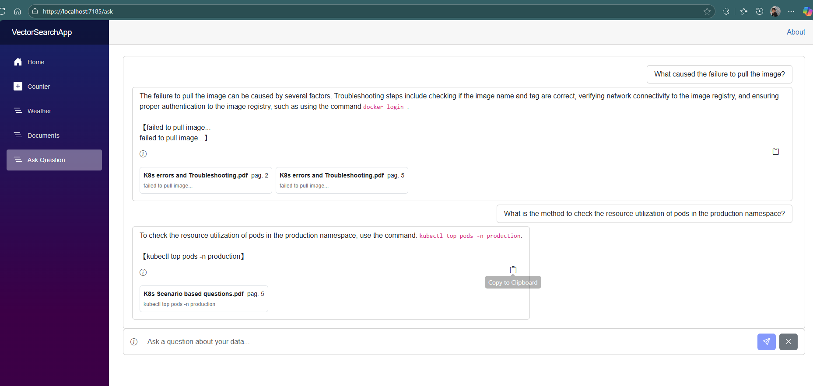
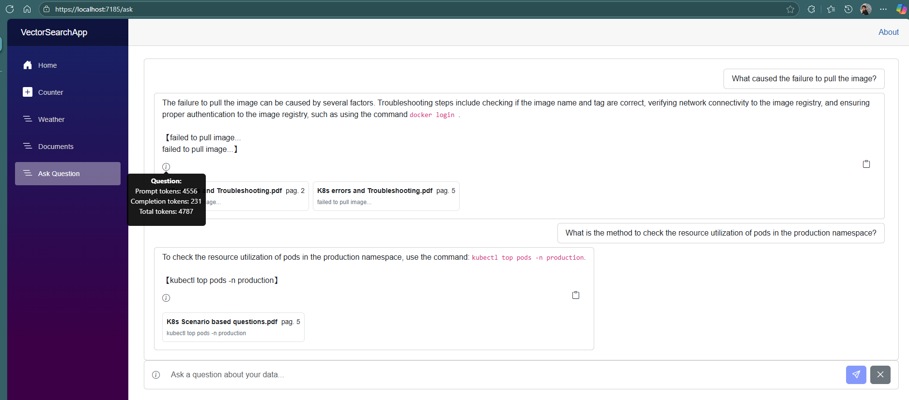
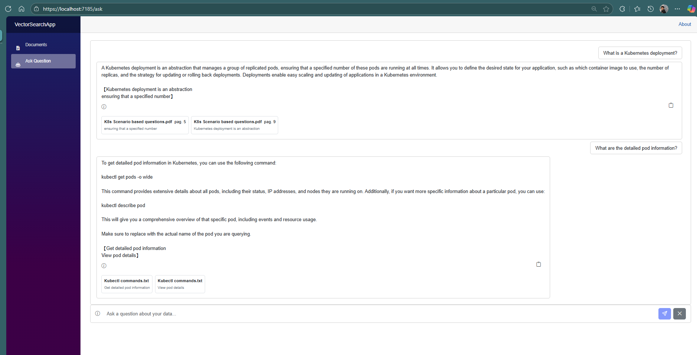

docker-compose down
docker system prune -f
rmdir /s /q mssql

docker-compose up -d mssql
docker-compose down --remove-orphans
docker-compose up -d

### Sql Server Database

## Endpoints

### Ask Endpoint:

