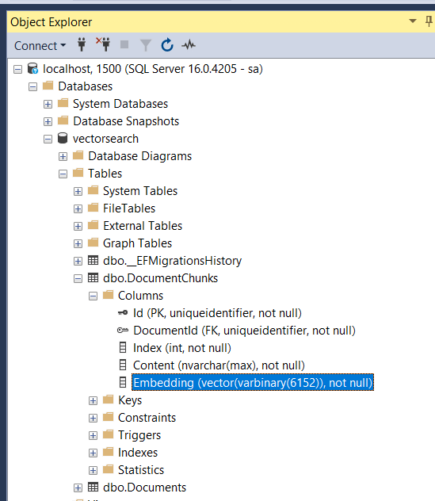
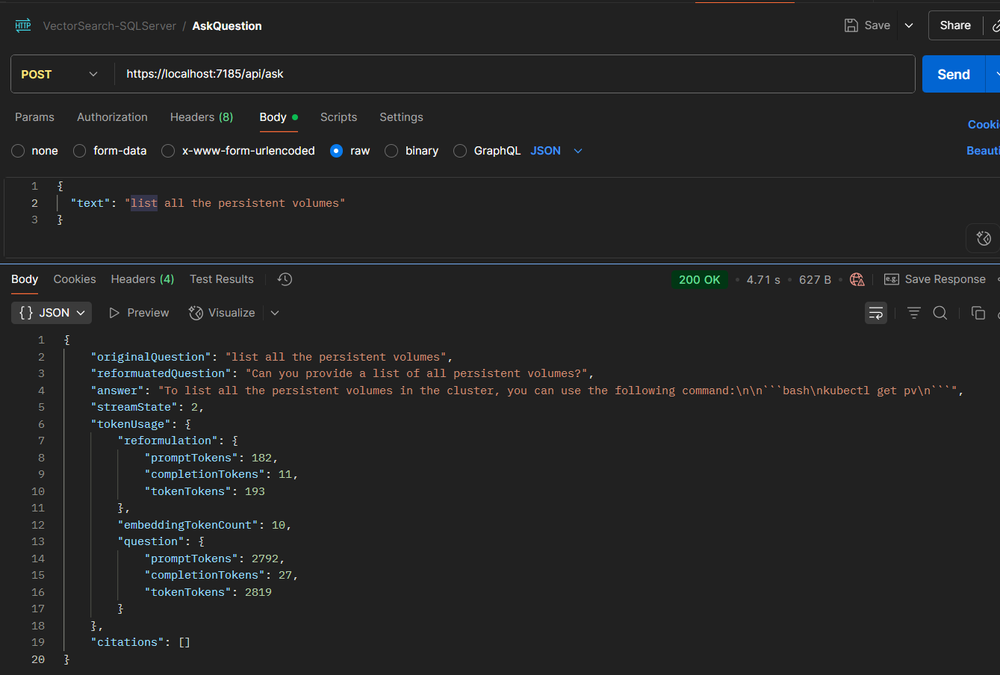

# AI Vector Search with SQL Server

A modern .NET 8 web application that enables intelligent document search using AI embeddings and SQL Server's vector search capabilities. Upload documents, ask questions, and get AI-powered answers with citations.

## 🚀 Features

- **Document Upload**: Support for PDF, DOCX, TXT, and Markdown files
- **AI-Powered Search**: Uses Azure OpenAI embeddings for semantic search
- **Intelligent Q&A**: Ask questions about your documents and get contextual answers
- **Citation Support**: Answers include references to source documents with page numbers
- **Real-time Chat**: Interactive chat interface with streaming responses
- **Vector Storage**: Leverages SQL Server's native vector search capabilities
- **Modern UI**: Built with Blazor Server and Bootstrap components

## 🏗️ Architecture

```
┌─────────────────┐    ┌──────────────────┐    ┌─────────────────┐
│   Blazor UI     │    │   API Endpoints  │    │  Azure OpenAI   │
│                 │    │                  │    │                 │
│ • Documents     │◄──►│ • /api/documents │◄──►│ • Embeddings    │
│ • Chat/Ask      │    │ • /api/ask       │    │ • Chat Completion│
└─────────────────┘    └──────────────────┘    └─────────────────┘
         │                       │                       │
         │                       │                       │
         ▼                       ▼                       ▼
┌─────────────────┐    ┌──────────────────┐    ┌─────────────────┐
│   Services      │    │  Content Decoders│    │  Text Chunkers  │
│                 │    │                  │    │                 │
│ • VectorSearch  │    │ • PDF Decoder    │    │ • Default       │
│ • Document      │    │ • DOCX Decoder   │    │ • Markdown      │
│ • Chat          │    │ • Text Decoder   │    │                 │
└─────────────────┘    └──────────────────┘    └─────────────────┘
         │                       │                       │
         │                       │                       │
         ▼                       ▼                       ▼
┌─────────────────────────────────────────────────────────────────┐
│                    SQL Server Database                          │
│                                                                 │
│ • Documents Table (metadata)                                    │
│ • DocumentChunks Table (text + vector embeddings)              │
│ • Vector Search with VECTOR(1536) data type                    │
└─────────────────────────────────────────────────────────────────┘
```

## 🛠️ Technology Stack

- **.NET 9**: Latest version of .NET framework
- **Blazor Server**: Interactive web UI framework
- **Entity Framework Core**: Database ORM with vector search support
- **SQL Server 2025**: Database with native vector search capabilities
- **Azure OpenAI**: AI services for embeddings and chat completion
- **BlazorBootstrap**: UI component library
- **Semantic Kernel**: AI orchestration framework

## 📋 Prerequisites

Before running this application, ensure you have:

1. **.NET 9 SDK** - [Download here](https://dotnet.microsoft.com/download/dotnet/9.0)
2. **SQL Server 2025** or **Azure SQL Database** (with vector search support)
3. **Azure OpenAI Service** account with:
   - Text embedding model (e.g., `text-embedding-ada-002`)
   - Chat completion model (e.g., `gpt-4` or `gpt-3.5-turbo`)
4. **Visual Studio 2022** or **VS Code** (recommended)

## ⚙️ Configuration

### 1. Database Setup

Create a SQL Server database and update the connection string in `appsettings.json`:

```json
{
  "ConnectionStrings": {
    "Default": "Server=localhost;Database=VectorSearchDB;Trusted_Connection=true;TrustServerCertificate=true;"
  }
}
```

### 2. Azure OpenAI Configuration

Add your Azure OpenAI settings to `appsettings.json`:

```json
{
  "AzureOpenAI": {
    "ChatCompletion": {
      "Deployment": "gpt-4",
      "Endpoint": "https://your-resource.openai.azure.com/",
      "ApiKey": "your-api-key-here",
      "ModelId": "gpt-4"
    },
    "Embedding": {
      "Deployment": "text-embedding-ada-002",
      "Endpoint": "https://your-resource.openai.azure.com/",
      "ApiKey": "your-api-key-here",
      "ModelId": "text-embedding-ada-002"
    }
  }
}
```

### 3. Application Settings

Configure chunking and processing settings:

```json
{
  "AppSettings": {
    "EmbeddingBatchSize": 10,
    "MaxTokensPerLine": 300,
    "MaxTokensPerParagraph": 1000,
    "OverlapTokens": 100,
    "MessageExpiration": "01:00:00"
  }
}
```

## 🚀 Getting Started

### 1. Clone the Repository

```bash
git clone <repository-url>
cd AI.SQLServer.VectorSearch
```

### 2. Restore Dependencies

```bash
dotnet restore
```

### 3. Update Database

Run Entity Framework migrations to create the database schema:

```bash
dotnet ef database update
```

### 4. Run the Application

```bash
dotnet run --project VectorSearchApp
```

The application will start at `https://localhost:7185` (or the port shown in the console).

## 📖 How to Use

### Uploading Documents

1. Navigate to the **Documents** page
2. Click **Browse** to select a file (PDF, DOCX, TXT, or MD)
3. Optionally enter a custom Document ID (GUID format)
4. Click **Upload** to process the document

The system will:
- Extract text content from the document
- Split it into manageable chunks
- Generate AI embeddings for each chunk
- Store everything in the database

### Asking Questions

1. Go to the **Ask Question** page
2. Type your question in the input field
3. Press **Enter** or click the **Send** button

The system will:
- Generate an embedding for your question
- Search for relevant document chunks using vector similarity
- Use AI to generate a contextual answer
- Provide citations with source document references

## 🔧 API Endpoints

### Document Management

- `POST /api/documents` - Upload and process a document
- `GET /api/documents` - List all uploaded documents
- `GET /api/documents/{id}/chunks` - Get chunks for a specific document

### Question & Answer

- `POST /api/ask` - Ask a question and get an answer
- `POST /api/ask/streaming` - Ask a question with streaming response

### Example API Response

```json
{
  "originalQuestion": "How do I troubleshoot Docker issues?",
  "reformulatedQuestion": "What are common Docker troubleshooting steps?",
  "answer": "To troubleshoot Docker issues, you should: 1) Check container logs using 'docker logs', 2) Verify image availability, 3) Check network connectivity...",
  "citations": [
    {
      "documentId": "uuid-here",
      "fileName": "docker-guide.pdf",
      "quote": "Check container logs",
      "pageNumber": 15
    }
  ],
  "tokenUsage": {
    "promptTokens": 1250,
    "completionTokens": 300,
    "totalTokens": 1550
  }
}
```

## 🗄️ Database Schema

### Documents Table
- `Id` (uniqueidentifier) - Primary key
- `Name` (nvarchar) - Original filename
- `CreationDate` (datetimeoffset) - Upload timestamp

### DocumentChunks Table
- `Id` (uniqueidentifier) - Primary key
- `DocumentId` (uniqueidentifier) - Foreign key to Documents
- `Text` (nvarchar) - Chunk content
- `Embedding` (vector(1536)) - AI-generated embedding
- `PageNumber` (int) - Source page number
- `CreationDate` (datetimeoffset) - Creation timestamp

## 🔍 How Vector Search Works

1. **Document Processing**: When you upload a document, it's split into chunks of ~300 tokens each
2. **Embedding Generation**: Each chunk is sent to Azure OpenAI to generate a 1536-dimensional vector embedding
3. **Storage**: Chunks and embeddings are stored in SQL Server using the `VECTOR(1536)` data type
4. **Query Processing**: When you ask a question, it's also converted to an embedding
5. **Similarity Search**: SQL Server finds the most similar document chunks using vector distance calculations
6. **Answer Generation**: The relevant chunks are sent to the AI model to generate a contextual answer

## 🛡️ Security Considerations

- **API Keys**: Store Azure OpenAI keys securely (use Azure Key Vault in production)
- **Input Validation**: The application validates file types and sizes
- **SQL Injection**: Entity Framework provides protection against SQL injection
- **File Upload**: Limits file sizes to prevent abuse (20MB default)

## 🚨 Troubleshooting

### Common Issues

1. **Database Connection Failed**
   - Verify SQL Server is running
   - Check connection string format
   - Ensure database exists

2. **Azure OpenAI Errors**
   - Verify API keys are correct
   - Check endpoint URLs
   - Ensure sufficient quota/credits

3. **Vector Search Not Working**
   - Confirm SQL Server 2022 or Azure SQL with vector support
   - Verify migrations ran successfully
   - Check embedding dimensions match (1536)

4. **File Upload Issues**
   - Ensure file size is under 20MB
   - Check supported file types (PDF, DOCX, TXT, MD)
   - Verify sufficient disk space

### Debug Mode

Enable detailed logging in `appsettings.Development.json`:

```json
{
  "Logging": {
    "LogLevel": {
      "Default": "Information",
      "Microsoft.AspNetCore": "Warning",
      "VectorSearchApp": "Debug"
    }
  }
}
```

## 🤝 Contributing

1. Fork the repository
2. Create a feature branch (`git checkout -b feature/amazing-feature`)
3. Commit your changes (`git commit -m 'Add amazing feature'`)
4. Push to the branch (`git push origin feature/amazing-feature`)
5. Open a Pull Request

## 📄 License

This project is licensed under the MIT License - see the [LICENSE](LICENSE) file for details.

## 🙏 Acknowledgments

- **Microsoft** for .NET 8 and Entity Framework Core
- **Azure OpenAI** for AI capabilities
- **SQL Server Team** for vector search support
- **Blazor Community** for UI components

---

## 📊 Current Database Schema



*The database contains Documents and DocumentChunks tables with vector embeddings for semantic search.*

## 🎯 Sample API Responses

### Ask Endpoint Response:


*Example showing question reformulation, AI-generated answer, and citation tracking with token usage statistics.*