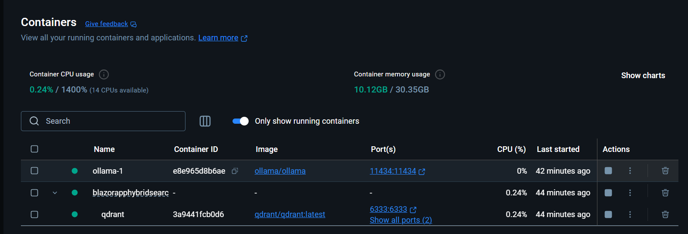

# Vector Hybrid Search using Qdrant, Ollama and .Net Blazor

- Used Qdrant to store the vector embedding
- Used Ollama llava model to generate embeddings.
- Run the Qdrant and Ollama in Docker.


Run Ollama and Model in docker:
```
docker run -d -v ollama:/root/.ollama -p 11434:11434 --name ollama-1 ollama/ollama

# Note the Container Id
docker ps -a

docker exec -it e8e965d8b6ae bash

# ollama run llava
```


