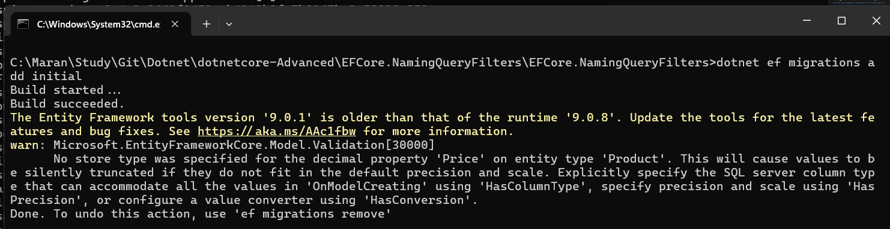
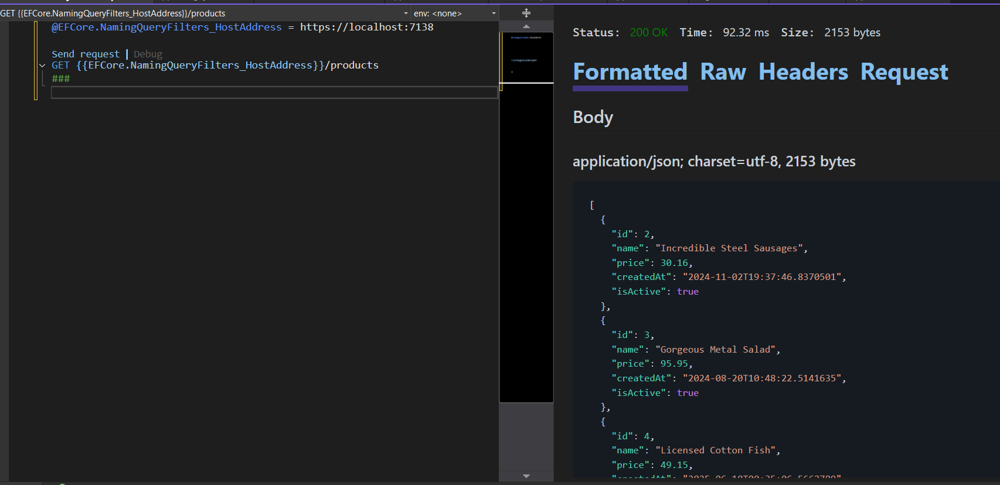
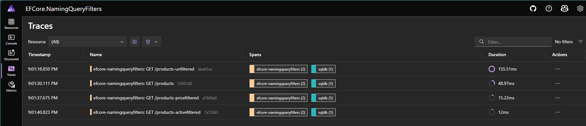

# EFCore Query Filter Comparison: .NET 9 vs .NET 10 with Named Query Filters

Demonstration project comparing EFCore Query Filters between .NET 9 and .NET 10, showcasing the new Named Query Filters feature in EFCore 10 using a Product management system with automatic filtering of inactive products.

## Features

- **EFCore 9 Query Filters**: Traditional anonymous query filters with single filter limitation
- **EFCore 10 Named Query Filters**: New named query filters allowing multiple filters per entity
- **Selective Filter Control**: Ability to ignore specific named filters while keeping others active
- **ASP.NET Core Minimal APIs**: Clean endpoint definitions for product operations
- **Entity Framework Core 10.0**: Latest EF Core preview features and improvements
- **SQL Server Integration**: Uses SQL Server with Aspire for local development
- **Bogus Data Generation**: Fake data generation for testing

## Project Structure

```
EFCore.NamingQueryFilters/
├── Model/
│   └── Product.cs              # Product entity with IsActive property
├── Endpoints/
│   └── ProductsEndpoints.cs    # Minimal API endpoints
├── Extensions/
│   └── AppExtensions.cs        # Extension methods
├── Data/
│   └── DatabaseSeedService.cs  # Data seeding service
├── Migrations/                 # EF Core migrations
├── AppDbContext.cs            # DbContext with query filter
└── Program.cs                 # Application entry point
```

## EFCore 9 vs EFCore 10 Query Filter Comparison

### EFCore 9 Implementation (Previous)

In EFCore 9, only one query filter per entity was supported:

```csharp
protected override void OnModelCreating(ModelBuilder modelBuilder)
{
    modelBuilder.Entity<Product>().HasQueryFilter(p => p.IsActive);
}
```

### EFCore 10 Implementation (Current) - Named Query Filters

EFCore 10 introduces Named Query Filters, allowing multiple filters per entity:

```csharp
protected override void OnModelCreating(ModelBuilder modelBuilder)
{
    modelBuilder.Entity<Product>()
                .HasQueryFilter(ProductFilters.ActiveFilter, p => p.IsActive) 
                .HasQueryFilter(ProductFilters.PriceFilter, p => p.Price > 10); 
}

public static class ProductFilters
{
    public const string ActiveFilter = "ActiveFilter";
    public const string PriceFilter = "PriceFilter";
}
```

## Setup & Migration

### Create migrations
```bash
dotnet ef migrations add InitialCreate
```

*Initial Migration*

### Run the application
```bash
dotnet run
```

## API Endpoints

### Standard Endpoints
- `GET /products` - Get all products (both filters applied automatically)
- `GET /products/{id}` - Get specific product by ID (if passes all filters)

### EFCore 10 Named Filter Control Endpoints
- `GET /products-unfiltered` - Get all products (ignores all query filters)
- `GET /products-pricefiltered` - Get products with only price filter (ignores ActiveFilter)
- `GET /products-activefiltered` - Get products with only active filter (ignores PriceFilter)

## EFCore 9 Query Filter Behavior

### Single Filter Support

```sql
SELECT [p].[Id], [p].[CreatedAt], [p].[IsActive], [p].[Name], [p].[Price]
FROM [Products] AS [p]
WHERE [p].[IsActive] = CAST(1 AS bit)
```


*IsActive Filtered Output*

### Multiple Filter Limitation in EFCore 9

If multiple query filters were set in EFCore 9, only the last one would be used:

```csharp
 protected override void OnModelCreating(ModelBuilder modelBuilder)
 {
     modelBuilder.Entity<Product>()
                 .HasQueryFilter(p => p.IsActive) // This will be excluded
                 .HasQueryFilter(p=>p.Price >10); // This will be used in the Query filter
 }
```
```sql
SELECT [p].[Id], [p].[CreatedAt], [p].[IsActive], [p].[Name], [p].[Price]
FROM [Products] AS [p]
WHERE [p].[Price] > 10.0
```

### EFCore 9 Workaround for Multiple Conditions

```csharp
        // Alternative way to set multiple filters in EFCore 9
        modelBuilder.Entity<Product>()
            .HasQueryFilter(p => p.IsActive && p.Price > 10);
```

```sql
SELECT [p].[Id], [p].[CreatedAt], [p].[IsActive], [p].[Name], [p].[Price]
FROM [Products] AS [p]
WHERE [p].[IsActive] = CAST(1 AS bit) AND [p].[Price] > 10.0
```

## EFCore 10 Named Query Filters in Action



```sql
-- products-unfiltered
Executed DbCommand (9ms) [Parameters=[], CommandType='Text', CommandTimeout='30']
SELECT [p].[Id], [p].[CreatedAt], [p].[IsActive], [p].[Name], [p].[Price]
FROM [Products] AS [p]

-- products filter with both query parameters
Executed DbCommand (4ms) [Parameters=[], CommandType='Text', CommandTimeout='30']
SELECT [p].[Id], [p].[CreatedAt], [p].[IsActive], [p].[Name], [p].[Price]
FROM [Products] AS [p]
WHERE [p].[IsActive] = CAST(1 AS bit) AND [p].[Price] > 10.0

-- products-pricefiltered
Executed DbCommand (4ms) [Parameters=[], CommandType='Text', CommandTimeout='30']
SELECT [p].[Id], [p].[CreatedAt], [p].[IsActive], [p].[Name], [p].[Price]
FROM [Products] AS [p]
WHERE [p].[Price] > 10.

-- products-IsActiveFiltered
Executed DbCommand (4ms) [Parameters=[], CommandType='Text', CommandTimeout='30']
SELECT [p].[Id], [p].[CreatedAt], [p].[IsActive], [p].[Name], [p].[Price]
FROM [Products] AS [p]
WHERE [p].[IsActive] = CAST(1 AS bit)
```

## Key Dependencies

### Current (.NET 10)
- Microsoft.EntityFrameworkCore 10.0.0-preview.6.25358.103
- Microsoft.EntityFrameworkCore.SqlServer 10.0.0-preview.6.25358.103
- Microsoft.AspNetCore.OpenApi 10.0.0-preview.6.25358.103
- Aspire.Microsoft.Data.SqlClient 9.4.0
- Bogus 35.6.3

### Previous (.NET 9)
- Microsoft.EntityFrameworkCore 9.0.8
- Microsoft.EntityFrameworkCore.SqlServer 9.0.8

## Summary

This project demonstrates the significant improvement in EFCore 10's Named Query Filters over EFCore 9's traditional approach:

**EFCore 9 Limitations:**
- Only one query filter per entity
- Multiple filters require combining conditions with `&&`
- No selective filter control

**EFCore 10 Advantages:**
- Multiple named filters per entity
- Selective filter ignoring with `IgnoreQueryFilters([filterName])`
- Better maintainability and flexibility
- Granular control over which filters to apply

The Named Query Filters feature in EFCore 10 provides developers with more precise control over data filtering, making it easier to build complex applications with varying filter requirements.