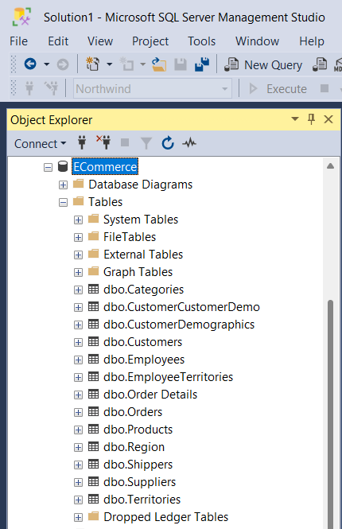
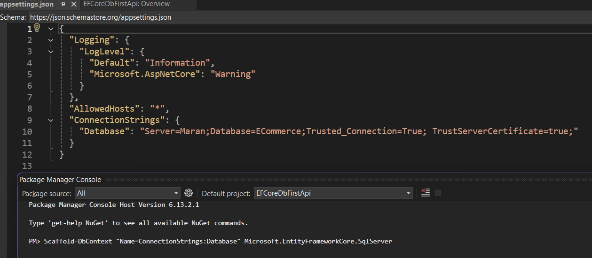
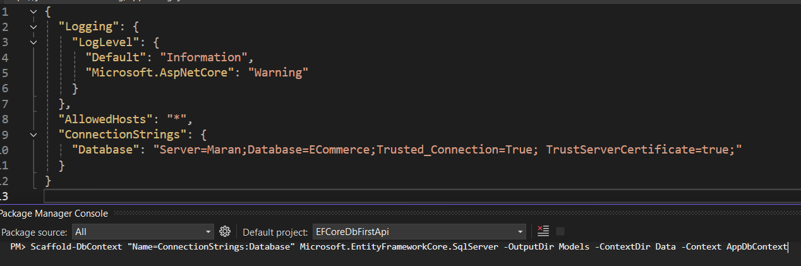
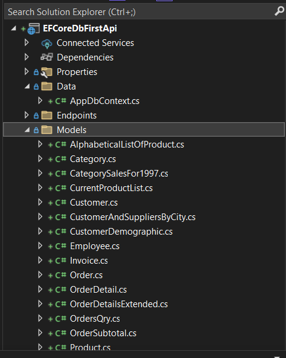

# Perform Database First in EFCore in .Net Web Api 



Scaffold Option 1:



Using Package Manager Console:
```powershell
Scaffold-DbContext "Your-Connection-String" Microsoft.EntityFrameworkCore.SqlServer -OutputDir Models
```

Using .Net CLI
``` bash
dotnet ef dbcontext scaffold "Your-Connection-String" Microsoft.EntityFrameworkCore.SqlServer -o Models
```
To Create DbContext file in Data folder and Keep model classes in the Models folder
```bash
Scaffold-DbContext "Your-Connection-String" Microsoft.EntityFrameworkCore.SqlServer -OutputDir Models -ContextDir Data
```
- Using .Net Cli
```bash
dotnet ef dbcontext scaffold "Your-Connection-String" Microsoft.EntityFrameworkCore.SqlServer -o Models --context-dir Data
```

To Customize the DbContext name 
```bash
Scaffold-DbContext "Your-Connection-String" Microsoft.EntityFrameworkCore.SqlServer -OutputDir Models -ContextDir Data -Context YourDbContext
```

- Create all model classes in the Models folder

- Create the DbContext file in the Data folder

- Name your DbContext as specified (e.g., YourDbContext)

Scaffold Option used:

```bash
Scaffold-DbContext "Name=ConnectionStrings:Database" Microsoft.EntityFrameworkCore.SqlServer -OutputDir Models -ContextDir Data -Context AppDbContext
``` 


- scaffolded files:

