# EFCore Migrations Tools update in .Net 9
- Contains different Entity Framework Migration options using EFCore Tools.

- Create a new Model Customer
- Setup DbContext
- Before applying the migrations check for model changes.

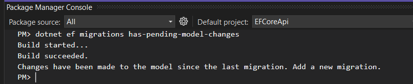

- Create new initial Migration

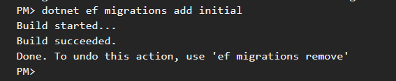

Add new Column to the existing Model
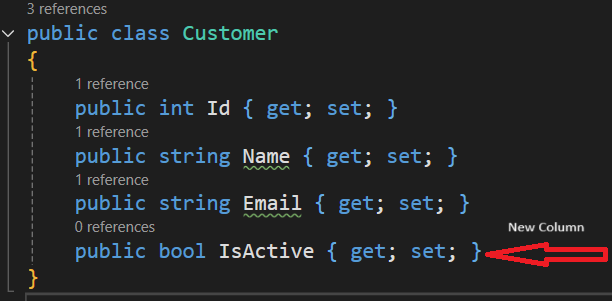

- Check for model changes

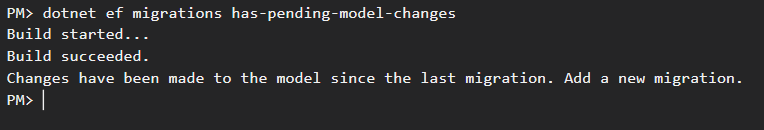

- Revert back the changes in the model.
```csharp
public class Customer
{
    public int Id { get; set; }
    public string Name { get; set; }
    public string Email { get; set; }   
}
```
- Now check for the model change

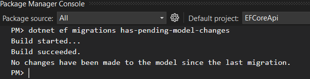

## Update to the Database

```bash
# update the migrations to the database
> dotnet ef database update
```
Alternatively we can get the script in the context to a sql file using below

```bash
# get Sql statement for the migration
> dotnet ef dbcontext script -o update.sql
```
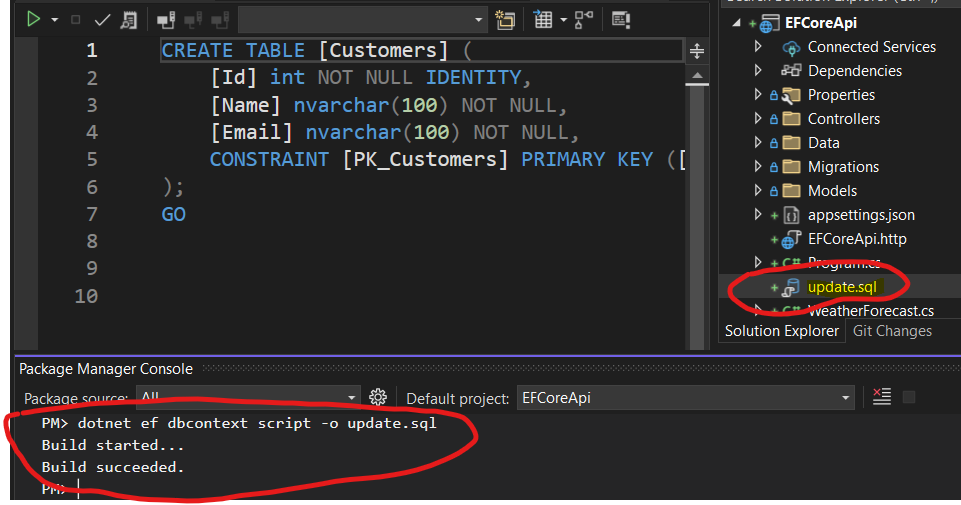

## List Migrations

```bash
> dotnet ef migrations list
# this will generate script for the db objects along with MigrationHistory table
> dotnet ef migrations script -o update.sql
```
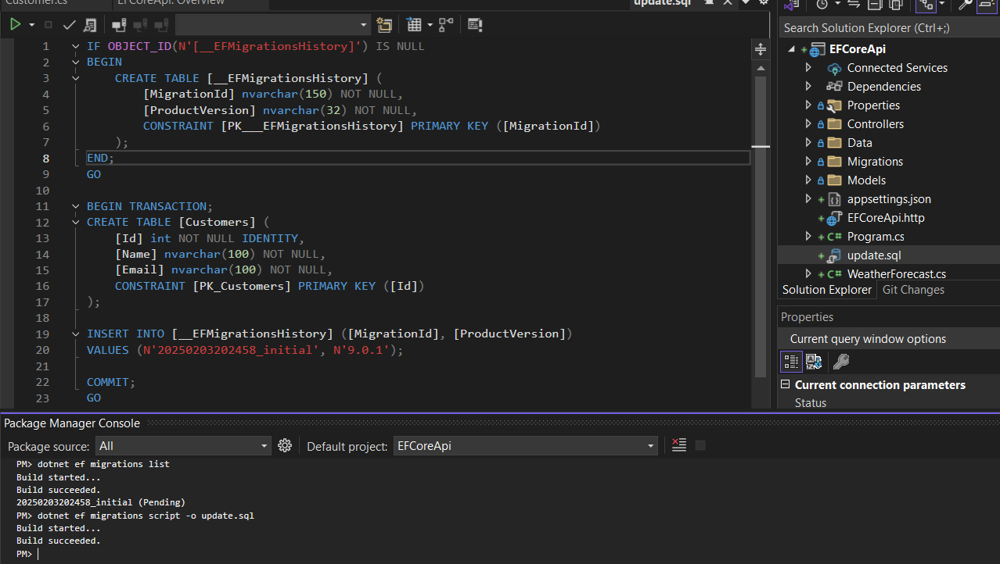

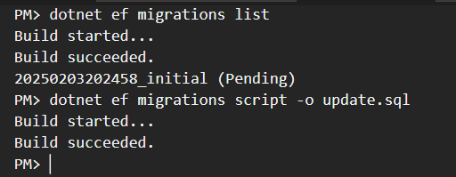

- use -i flag for Idempotent script

## Apply the database update

```bash
> dotnet ef database update
```
- After database update

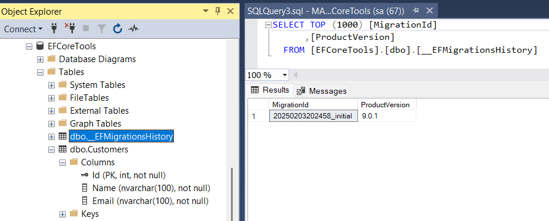

- Now update the model to have a new property and create a new migration

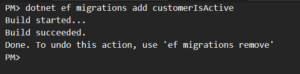


```bash
# generate the migration script after the initial migration
> dotnet ef migrations script 20250203202458_initial -o update.sql 
```
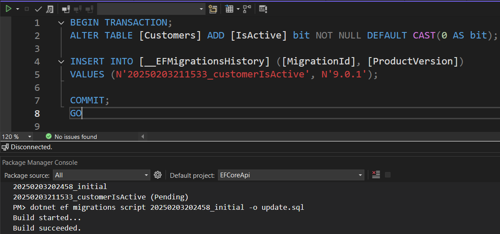

- With idempotent flag -i the above command will create the script with If exists check.

```bash
# generate script with idempotent flag
> dotnet ef migrations script 20250203202458_initial -o update.sql -i
```
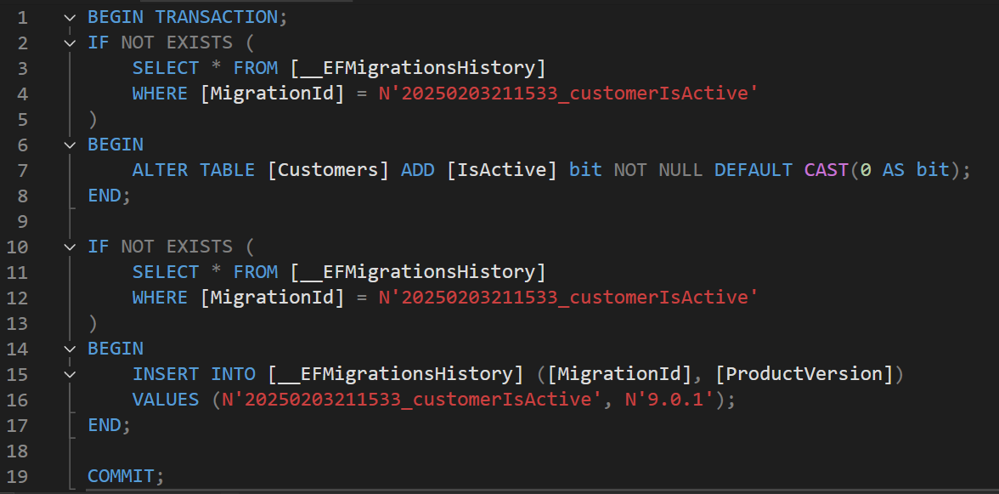

## Create Bundle migrations
Using this option you can create a bundle (an .exe file) which contains a migration.
```bash
> dotnet ef migrations bundle
```

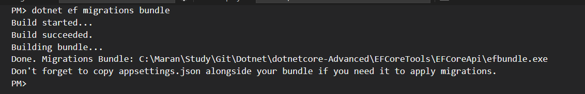

- Copy and share the efbundle.exe to run the migration.
- Note: Ensure the appSettings.json is also present in the same folder when running the exe.
- Or use Environment variables or ConnectionString from Azure KeyVault instead of appSettings.json also.

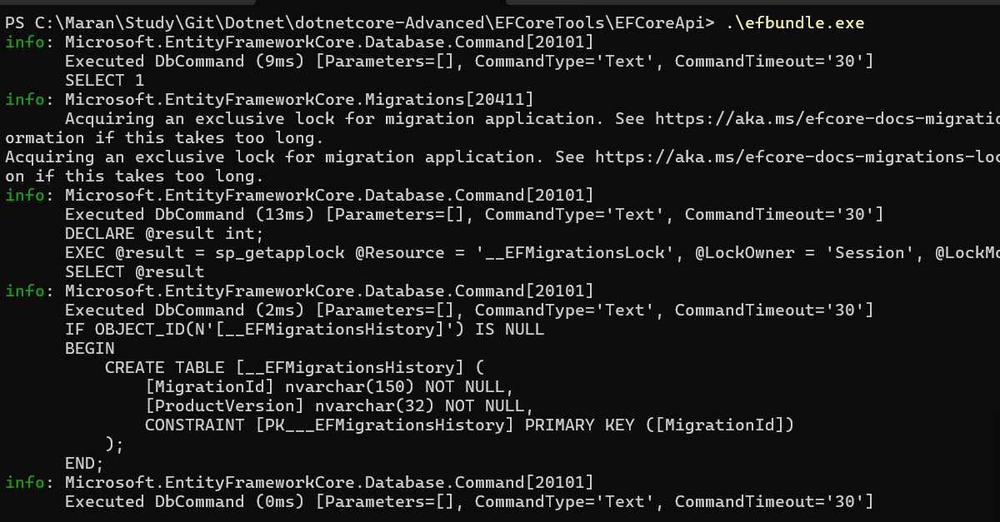

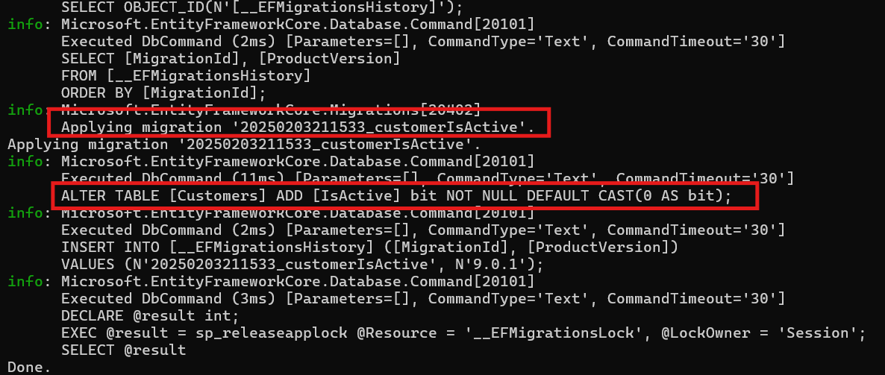

## Create Compiled model for optimized quering

```bash
> dotnet ef dbcontext optimize -o ./Data/Optimized/
```
- The above command will create a Optimized folder will compiled models.

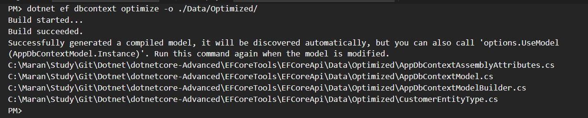

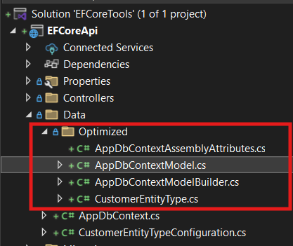

- So, when everytime the model changes run the above command to recreate the compiled models for better performance.
