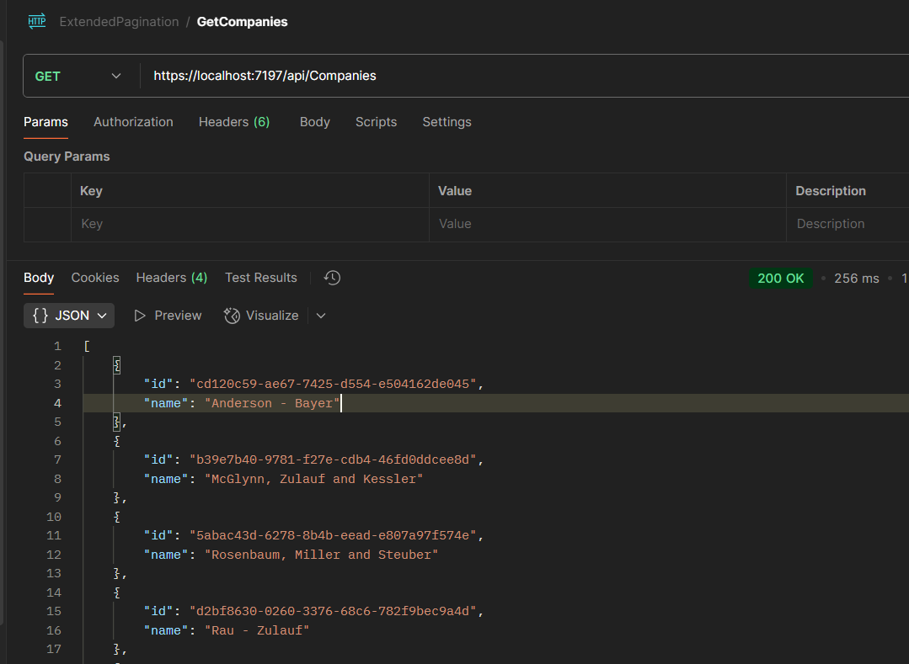
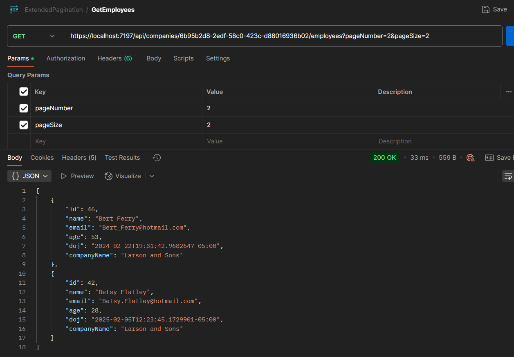
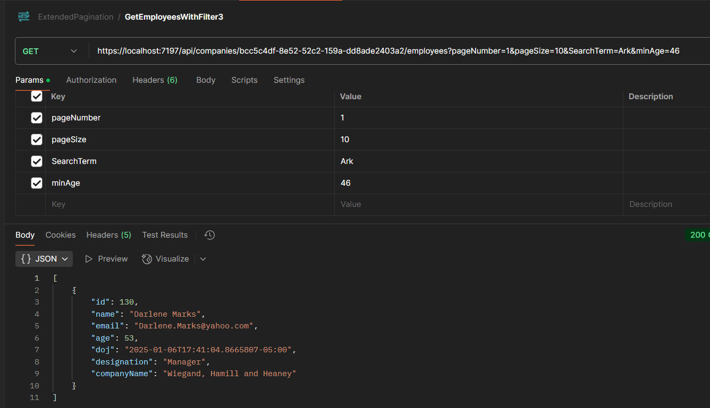
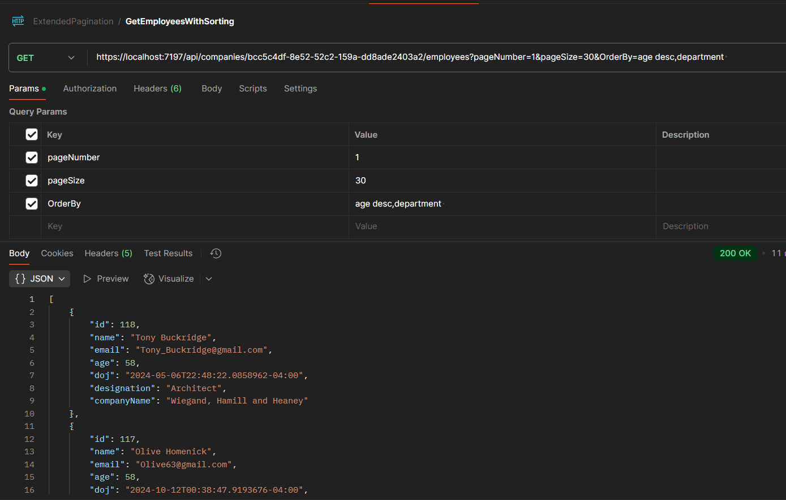

# Advanced Pagination with Sorting and Filtering in .Net Web API

A comprehensive .NET Web API demonstrating advanced pagination, sorting, and filtering capabilities with Entity Framework Core and AutoMapper.

## Screenshots





- Search Term on name field


- Sort by multiple fields


- Added Seq to capture the log


## API Documentation

### Base URL
```
http://localhost:5169/api
```

### Authentication
This API currently does not require authentication. All endpoints are publicly accessible.

### Endpoints

#### 1. Get Companies
Retrieve all available companies.

**Endpoint:** `GET /api/companies`

**Response:**
```json
[
  {
    "id": "3fa85f64-5717-4562-b3fc-2c963f66afa6",
    "name": "Company Name"
  }
]
```

#### 2. Get Employees (with Pagination, Sorting & Filtering)
Retrieve employees for a specific company with advanced pagination, sorting, and filtering options.

**Endpoint:** `GET /api/companies/{companyId}/employees`

**Path Parameters:**
- `companyId` (required): GUID - The unique identifier of the company

**Query Parameters:**
- `pageNumber` (optional): int - Page number (default: 1)
- `pageSize` (optional): int - Number of items per page (default: 10, max: 50)
- `searchTerm` (optional): string - Search term to filter employees by name
- `minAge` (optional): uint - Minimum age filter
- `maxAge` (optional): uint - Maximum age filter
- `orderBy` (optional): string - Field(s) to sort by (default: "name")

**Sample Requests:**

1. **Basic pagination:**
```http
GET /api/companies/3fa85f64-5717-4562-b3fc-2c963f66afa6/employees?pageNumber=1&pageSize=10
```

2. **With search term:**
```http
GET /api/companies/3fa85f64-5717-4562-b3fc-2c963f66afa6/employees?searchTerm=john&pageNumber=1&pageSize=10
```

3. **With age filtering:**
```http
GET /api/companies/3fa85f64-5717-4562-b3fc-2c963f66afa6/employees?minAge=25&maxAge=45&pageNumber=1&pageSize=10
```

4. **With sorting:**
```http
GET /api/companies/3fa85f64-5717-4562-b3fc-2c963f66afa6/employees?orderBy=age desc,name&pageNumber=1&pageSize=10
```

5. **Combined filters:**
```http
GET /api/companies/3fa85f64-5717-4562-b3fc-2c963f66afa6/employees?searchTerm=dev&minAge=25&maxAge=40&orderBy=age desc&pageNumber=1&pageSize=15
```

**Response Headers:**
- `X-Pagination`: JSON string containing pagination metadata

**Response Body:**
```json
[
  {
    "id": 1,
    "name": "John Doe",
    "email": "john.doe@company.com",
    "age": 30,
    "doj": "2022-01-15T00:00:00",
    "designation": "Software Developer",
    "companyName": "Tech Corp"
  }
]
```

**Pagination Metadata (X-Pagination header):**
```json
{
  "currentPage": 1,
  "totalPages": 5,
  "pageSize": 10,
  "totalCount": 50,
  "hasPrevious": false,
  "hasNext": true
}
```

### Sorting

The API supports sorting by multiple fields using the `orderBy` parameter:

- **Single field:** `orderBy=name`
- **Multiple fields:** `orderBy=age desc,name asc`
- **Available sort fields:** name, email, age, doj, designation
- **Sort directions:** asc (ascending), desc (descending)
- **Default:** name (ascending)

### Filtering

The API supports the following filters:

1. **Text Search:** `searchTerm` - Searches within employee names
2. **Age Range:** `minAge` and `maxAge` - Filter employees by age range
3. **Combined Filters:** All filters can be used together

### Error Responses

**400 Bad Request:**
```json
{
  "type": "https://tools.ietf.org/html/rfc7231#section-6.5.1",
  "title": "One or more validation errors occurred.",
  "status": 400,
  "errors": {
    "companyId": ["The value 'invalid-guid' is not valid."]
  }
}
```

**404 Not Found:**
```json
{
  "type": "https://tools.ietf.org/html/rfc7231#section-6.5.4",
  "title": "Not Found",
  "status": 404
}
```

### Usage Examples

#### Using cURL

```bash
# Get all companies
curl -X GET "http://localhost:5169/api/companies" \
  -H "Accept: application/json"

# Get employees with pagination
curl -X GET "http://localhost:5169/api/companies/{companyId}/employees?pageNumber=1&pageSize=10" \
  -H "Accept: application/json"

# Get employees with search and sorting
curl -X GET "http://localhost:5169/api/companies/{companyId}/employees?searchTerm=john&orderBy=age desc&pageNumber=1&pageSize=5" \
  -H "Accept: application/json"
```

#### Using JavaScript/Fetch

```javascript
// Get companies
const companies = await fetch('http://localhost:5169/api/companies')
  .then(response => response.json());

// Get employees with filters
const response = await fetch(
  'http://localhost:5169/api/companies/3fa85f64-5717-4562-b3fc-2c963f66afa6/employees?searchTerm=dev&minAge=25&maxAge=40&orderBy=age desc&pageNumber=1&pageSize=10'
);

const employees = await response.json();
const pagination = JSON.parse(response.headers.get('X-Pagination'));

console.log('Employees:', employees);
console.log('Pagination:', pagination);
```

### Development Setup

1. Clone the repository
2. Navigate to the `EmployeesApi` directory
3. Run `dotnet restore`
4. Run `dotnet run`
5. Access Swagger UI at `http://localhost:5169/swagger`
6. API will be available at `http://localhost:5169/api`

### Features

- ✅ Advanced pagination with metadata
- ✅ Multi-field sorting with custom directions
- ✅ Text search filtering
- ✅ Age range filtering
- ✅ Structured logging with Serilog and Seq
- ✅ OpenTelemetry tracing
- ✅ AutoMapper for DTO mapping
- ✅ In-memory database with seeded data
- ✅ Swagger/OpenAPI documentation