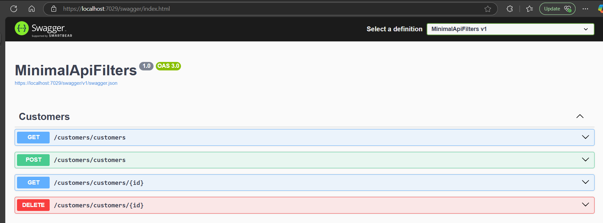

# Using IEndpointFilter to validate the Minimal API endpoints.
- used Sqlite with Dapper
- used FluentValidation for model validation
- Added IEndpointFilter to validate when creating new Customer object

