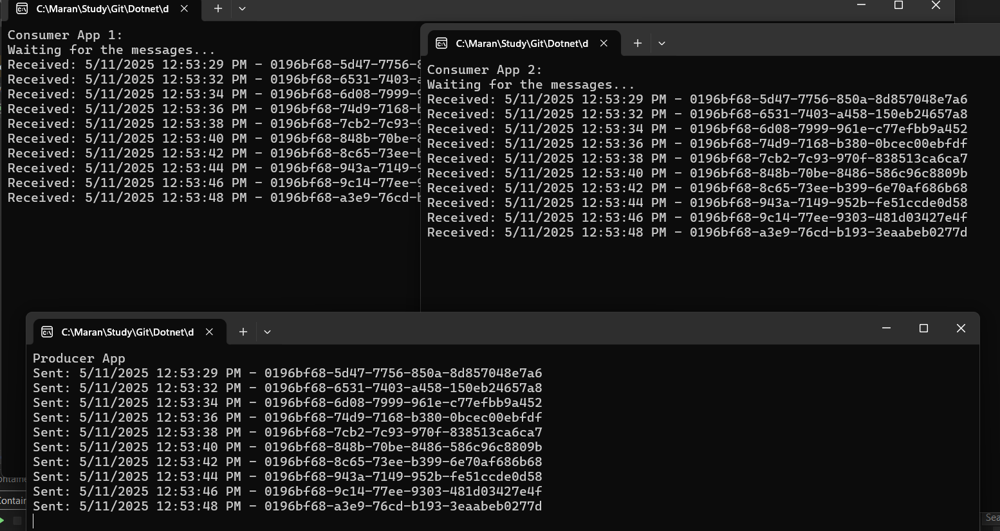
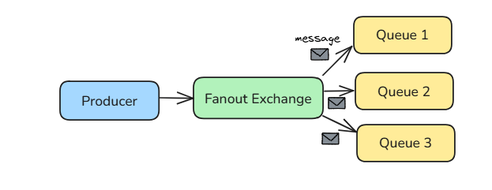
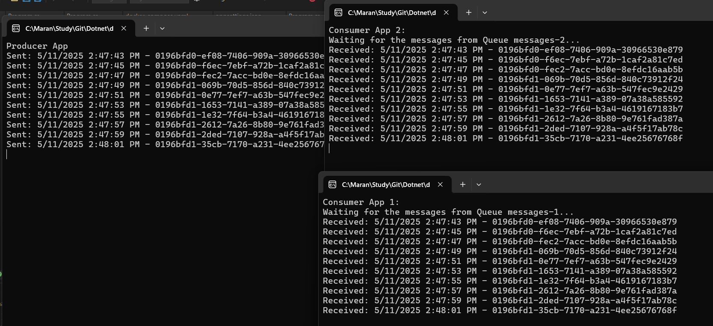
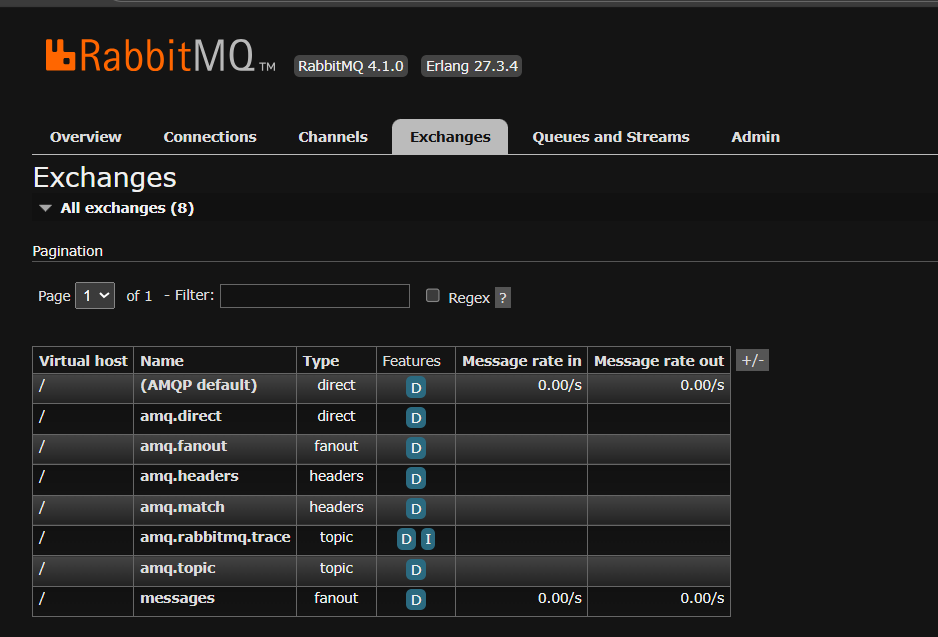
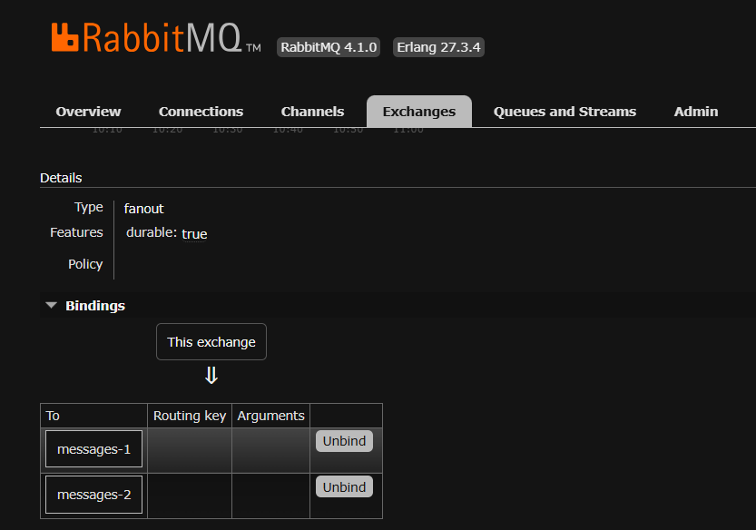
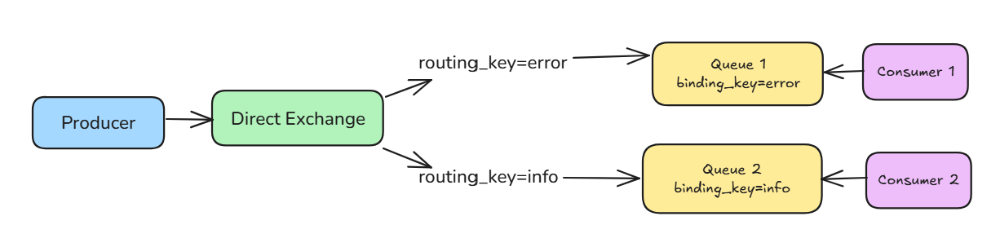
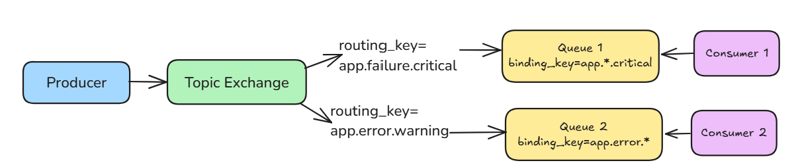

# RabbitMQ Exchange Patterns

This repository demonstrates different RabbitMQ messaging patterns and exchange types in .NET Core.

## Messaging Patterns

### Competing Consumers
Multiple consumers listen to the same queue, and each message is delivered to only one consumer. This pattern enables load balancing and horizontal scaling of message processing.

### Consumers with Separate Queues
Each consumer has its own queue, and messages are delivered to all queues. This means each message will be processed by all consumers.

## Exchange Types

RabbitMQ uses exchanges to route messages to queues based on different rules.

### Fanout Exchange
Broadcasts all messages to all queues bound to it, regardless of routing keys.

### Direct Exchange
Routes messages to queues based on an exact match between the routing key and the binding key.

### Topic Exchange
Routes messages to queues based on pattern matching between the routing key and the binding pattern.

## Getting Started

### Prerequisites
- .NET Core SDK
- RabbitMQ server running locally or accessible remotely

### Running the Examples
1. Clone this repository
2. Navigate to the project directory
3. Run the producer and consumer applications as needed for each example

## Project Structure
- `Producer`: Contains the message publishing applications
- `Consumer`: Contains the message consuming applications

## Additional Resources
- [RabbitMQ Official Documentation](https://www.rabbitmq.com/documentation.html)
- [RabbitMQ .NET Client Library](https://www.rabbitmq.com/dotnet.html)