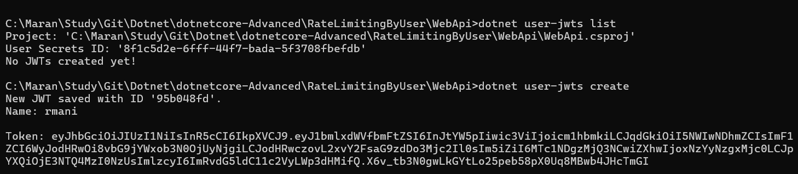
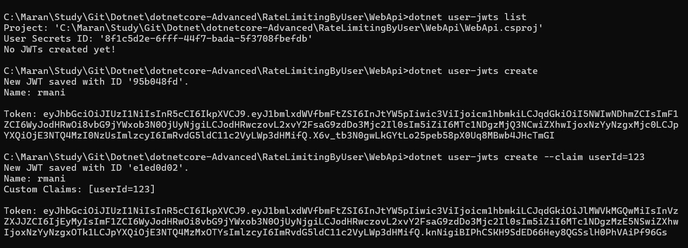
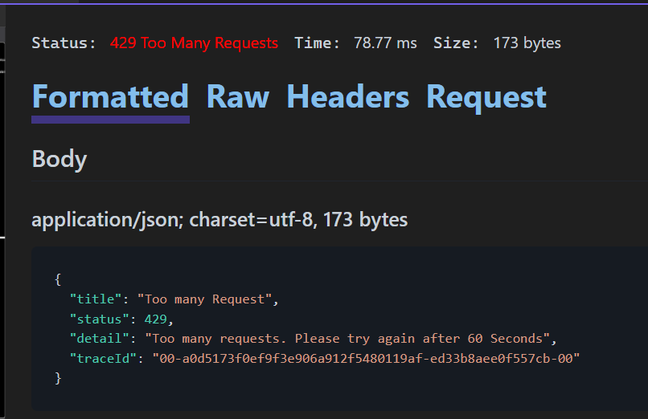
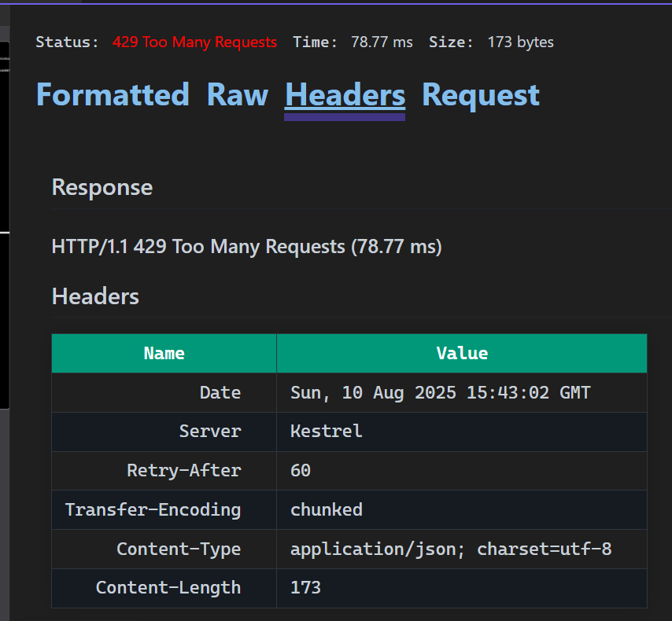

# Rate Limiting By User - .NET Core Advanced

A demonstration project showcasing user-based rate limiting implementation in ASP.NET Core using JWT authentication.

## Features

- **JWT Authentication**: Secure API endpoints with JWT tokens
- **Per-User Rate Limiting**: Different rate limits for authenticated vs anonymous users
- **Multiple Rate Limiting Strategies**: Fixed Window and Token Bucket limiters
- **Custom Error Handling**: Proper HTTP 429 responses with retry information
- **Minimal APIs & Controllers**: Both implementation patterns demonstrated

## Rate Limiting Policies

### 1. Fixed Window Limiter (`"fixed"`)
- **Limit**: 5 requests per minute
- **Usage**: Applied to controller endpoints
- **Reset**: Hard reset every minute

### 2. Per-User Policy (`"per-user"`)
- **Authenticated Users**: Token bucket (5 tokens, 2 replenished/minute)
- **Anonymous Users**: Fixed window (5 requests/minute)
- **Usage**: Applied to minimal API endpoints

## Project Structure

```
WebApi/
├── Controllers/
│   └── WeatherForecastController.cs    # Rate limited controller
├── Endpoints/
│   └── WeatherForecastEndpoints.cs     # Rate limited minimal API
├── AppExtensions.cs                    # Rate limiting configuration
├── Program.cs                          # Application setup
└── WeatherForecast.cs                  # Data model
```

## API Endpoints

### Controller Endpoint
- **GET** `/WeatherForecast` - Fixed window rate limiting (5/min)
- **Auth**: Required (JWT)
- **Rate Limit**: `"fixed"` policy

### Minimal API Endpoint
- **GET** `/weatherforecast-minimal` - Per-user rate limiting
- **Auth**: Required (JWT)
- **Rate Limit**: `"per-user"` policy

## Setup & Usage

### 1. Create User JWTs


### 2. Test Rate Limiting


### 3. Retry Information on Rejection


### 4. Too Many Requests Response


## Rate Limit Response Format

When rate limit is exceeded, the API returns:

```json
{
  "type": "https://tools.ietf.org/html/rfc7231#section-6.6.1",
  "title": "Too many Request",
  "status": 429,
  "detail": "Too many requests. Please try again after 60 Seconds"
}
```

**Headers:**
- `Retry-After`: Seconds to wait before retry
- `Content-Type`: application/json

## Key Implementation Details

### Rate Limiting Configuration
- **OnRejected Handler**: Custom 429 response with ProblemDetails
- **Metadata Support**: Retry-After header from rate limiter metadata
- **User Identification**: JWT `userId` claim for partitioning

### Middleware Order
```csharp
app.UseAuthentication();    // 1. Authenticate user
app.UseRateLimiter();      // 2. Apply rate limits
app.UseAuthorization();    // 3. Authorize access
```

## Testing

1. **Get JWT Token**: Use user creation endpoint
2. **Make Requests**: Send authenticated requests to endpoints
3. **Exceed Limits**: Continue requests to trigger rate limiting
4. **Check Headers**: Verify `Retry-After` and status codes

## Technologies Used

- **.NET 8**: Latest framework features
- **ASP.NET Core**: Web API framework
- **JWT Bearer**: Authentication
- **Rate Limiting**: Built-in middleware
- **ProblemDetails**: Standardized error responses