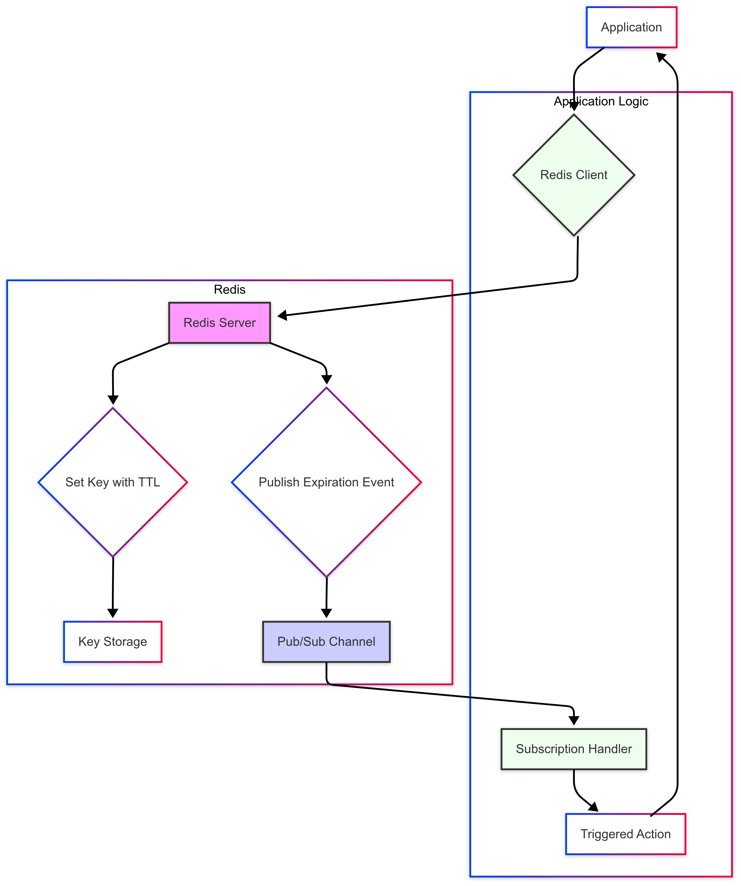

# Redis TTL and Trigger back on Timeout

A .NET Core console application that demonstrates how to work with Redis key expiration events and trigger custom actions when keys expire.

## Features
- Sets keys in Redis with Time-To-Live (TTL)

- Subscribes to Redis key expiration events

- Executes custom actions when keys expire

- Handles Redis connection errors gracefully

## How it works
1. Estabilish connection wth a 10-second TTL
2. Creates a key with a 10-sec TTL
3. Subscribes to Redis Key expiration events
4. Triggers custom action when the key expires.
5. Properly disposes of Redis connection