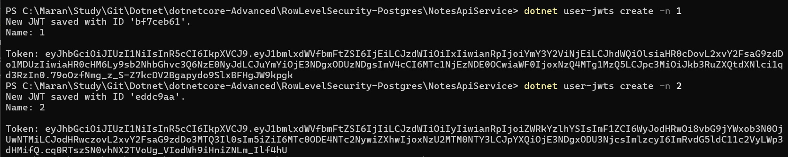
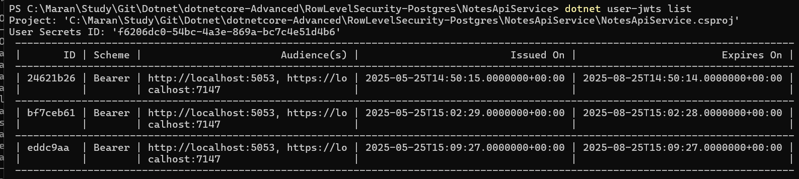
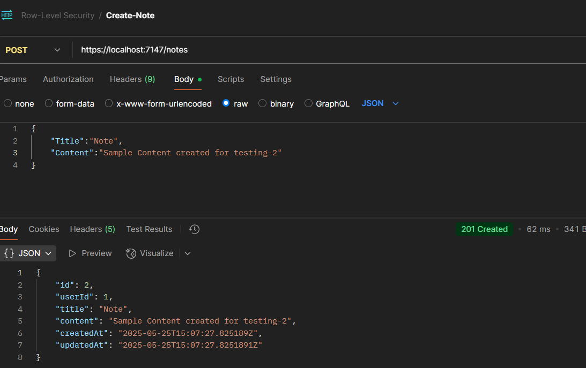
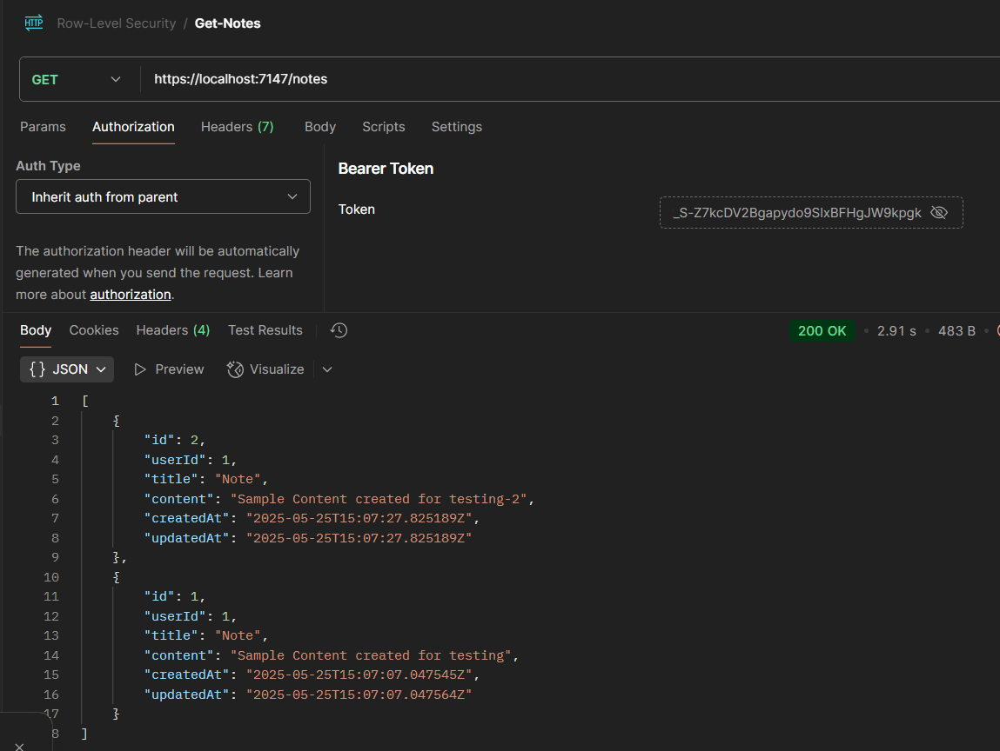
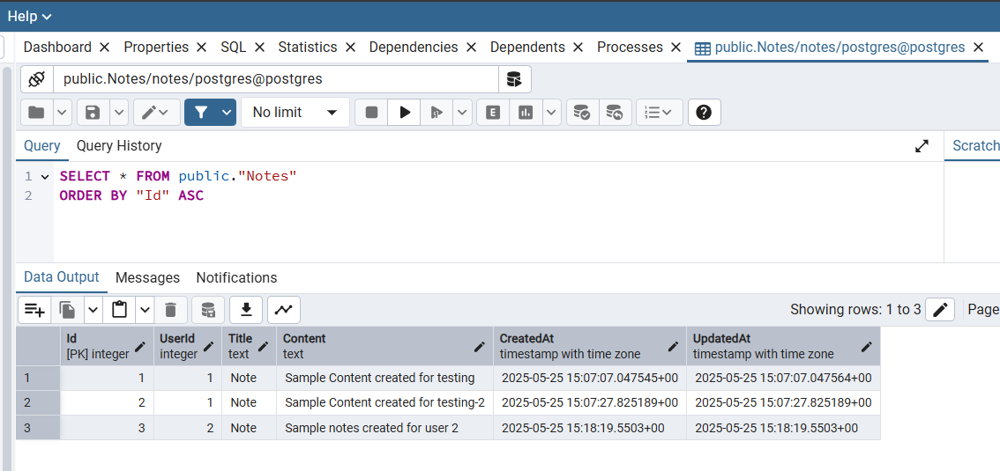
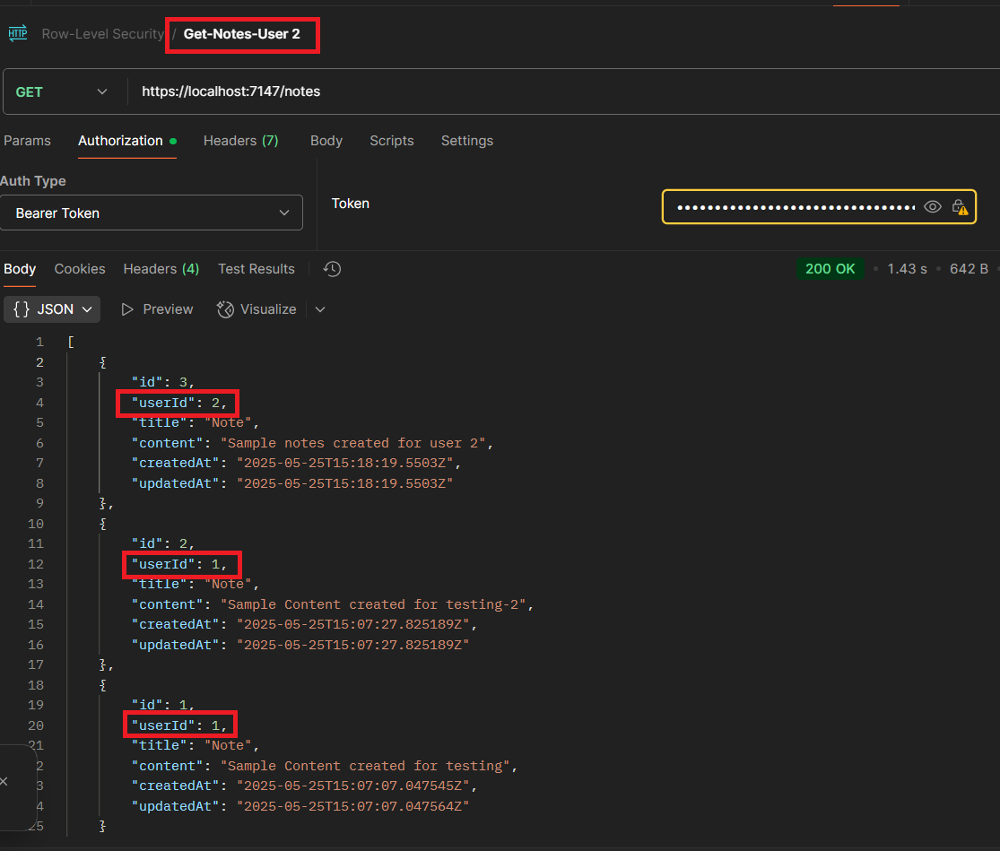
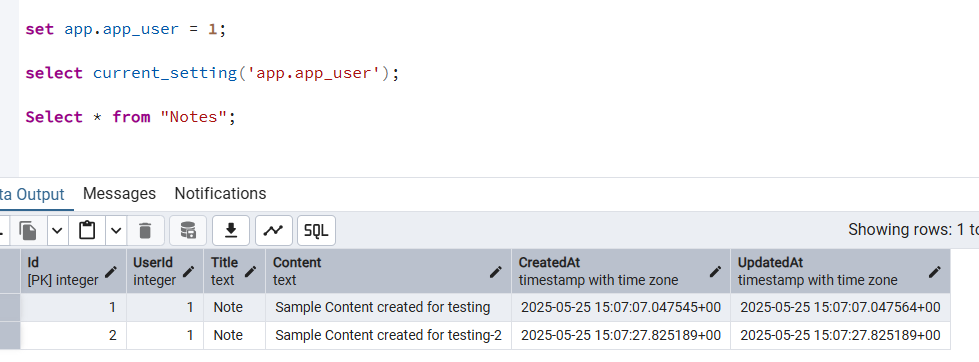
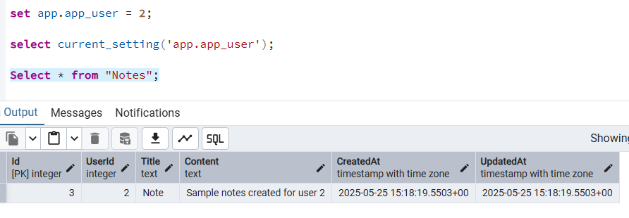
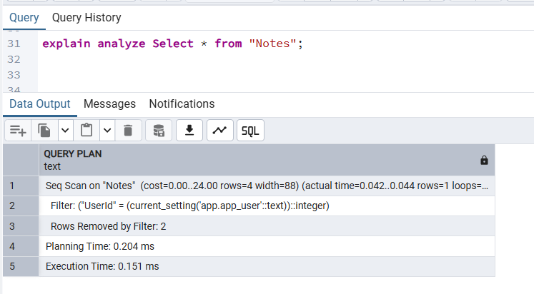

# Apply Row-Level Security for the Data in Postgres table

### Create User Jwts


### List available Jwts


### Create Notes


### Get Notes


### Notes data in Postgres


### List notes of all user without security trimmed
- Here for the User Id 2 it is listing the notes of the user 1 also. 



### Postgres sql statement changes

```sql
-- Selects all records from the "Notes" table and orders them by "Id" in ascending order
SELECT * FROM public."Notes"
ORDER BY "Id" ASC;

-- Enables Row-Level Security (RLS) on the "Notes" table to control access at the row level
ALTER TABLE "Notes" ENABLE ROW LEVEL SECURITY;

-- Drops the existing policy named "user_isolation_policy" if it exists on the "Notes" table
DROP POLICY IF EXISTS user_isolation_policy ON "Notes";

-- Creates a new row-level security policy named "user_isolation_policy" on the "Notes" table
-- This policy allows all operations (select, insert, update, delete) only on rows 
-- where the "UserId" column matches the current user's ID from a custom setting 'app.app_user'
CREATE POLICY user_isolation_policy ON "Notes"
FOR ALL
USING ("UserId" = current_setting('app.app_user')::int);

-- Selects all records from the "Notes" table to test data access after applying RLS policy
SELECT * FROM "Notes";

-- Creates a new database role named "app_user" with login privileges and a password
CREATE ROLE app_user LOGIN PASSWORD 'password123';

-- Grants permission to select, insert, update, and delete records in the "Notes" table to the app_user role
GRANT SELECT, INSERT, UPDATE, DELETE ON "Notes" TO app_user;

-- Grants usage permission on the "public" schema to the app_user role
GRANT USAGE ON SCHEMA public TO app_user;

-- Sets the current role to "app_user" for the following session/queries
SET ROLE app_user;

-- Sets the current app-specific setting 'app.app_user' to 2 (simulating user with ID = 2)
SET app.app_user = 2;

-- Retrieves the current value of the app-specific setting 'app.app_user'
SELECT current_setting('app.app_user');

-- Selects records from the "Notes" table for user with ID = 2 (based on the RLS policy)
SELECT * FROM "Notes";

-- Sets the current app-specific setting 'app.app_user' to 1 (simulating user with ID = 1)
SET app.app_user = 1;

-- Retrieves the current value of the app-specific setting 'app.app_user'
SELECT current_setting('app.app_user');

-- Selects records from the "Notes" table for user with ID = 1 (based on the RLS policy)
SELECT * FROM "Notes";

```

- Set App user to 1 and run the select query



- Set App user to 2 and run the select query



- Query planner

