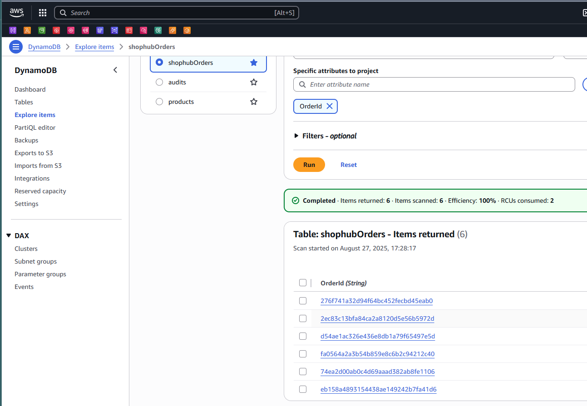

*Architecture*

- Create Order Event


*Create an Order in Postman*


*View the order details in Kinesis*


## From Amazon Kinesis data stream
```json
{
    "MessageId": "f5e69677-4f28-440a-a634-dd9375d01eea",
    "OccurredUtc": "2025-08-27T18:08:00.6483458Z",
    "Type": "OrderCreatedV1",
    "Version": 1,
    "CorrelationId": "7e0a0b8114f349a39b9ef303234f99b8",
    "PartitionKey": "7e0a0b8114f349a39b9ef303234f99b8",
    "Payload": {
        "OrderId": "7e0a0b8114f349a39b9ef303234f99b8",
        "UserId": "1",
        "TotalAmount": 1635.38,
        "Currency": "USD",
        "ProductIds": [
            "09144add-ddc6-4366-9d57-a6c24fa7d09c"
        ],
        "Quantities": {
            "09144add-ddc6-4366-9d57-a6c24fa7d09c": 2
        },
        "Channel": "Web",
        "Region": "us-east",
        "createdUtc": "2025-08-27T18:07:55.0888502Z"
    }
}
```

*Lambda function consumes event from Kinesis*


*Cloudwatch Log*


## Insert Records to DynamoDb

*CloudWatch Log for DB Insert*


*DynamoDB Table entries*