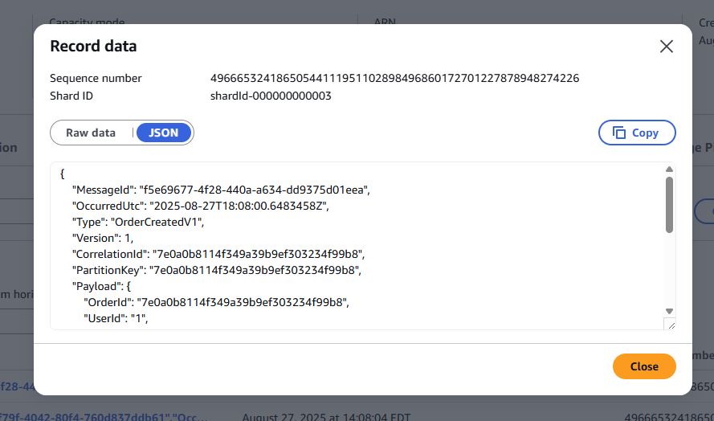
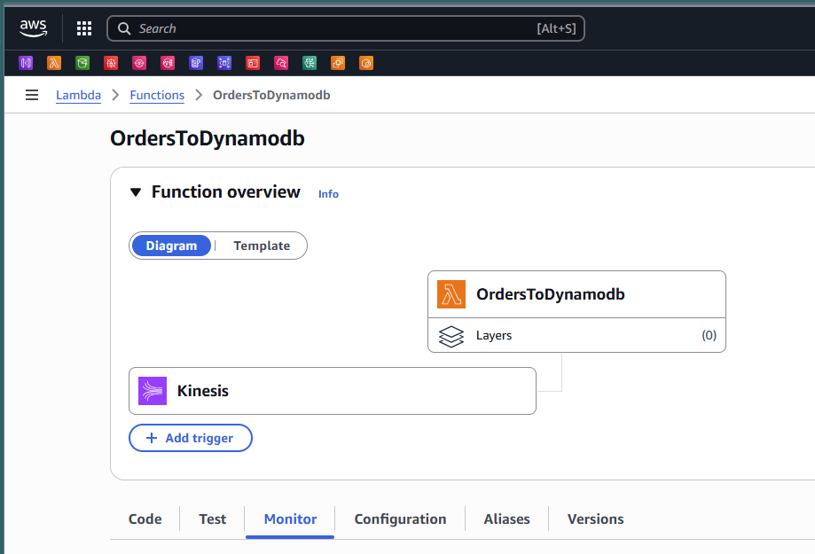

*Architecture*

- Create Order Event


*Create an Order in Postman*


*View the order details in Kinesis*



## From Amazon Kinesis data stream
```json
{
    "MessageId": "f5e69677-4f28-440a-a634-dd9375d01eea",
    "OccurredUtc": "2025-08-27T18:08:00.6483458Z",
    "Type": "OrderCreatedV1",
    "Version": 1,
    "CorrelationId": "7e0a0b8114f349a39b9ef303234f99b8",
    "PartitionKey": "7e0a0b8114f349a39b9ef303234f99b8",
    "Payload": {
        "OrderId": "7e0a0b8114f349a39b9ef303234f99b8",
        "UserId": "1",
        "TotalAmount": 1635.38,
        "Currency": "USD",
        "ProductIds": [
            "09144add-ddc6-4366-9d57-a6c24fa7d09c"
        ],
        "Quantities": {
            "09144add-ddc6-4366-9d57-a6c24fa7d09c": 2
        },
        "Channel": "Web",
        "Region": "us-east",
        "createdUtc": "2025-08-27T18:07:55.0888502Z"
    }
}
```

*Lambda function consumes event from Kinesis*


*Cloudwatch Log*


## Insert Records to DynamoDb

*CloudWatch Log for DB Insert*


*DynamoDB Table entries*

### Create Analytics table
```cli
aws dynamodb create-table --table-name Analytics --attribute-definitions AttributeName=PK,AttributeType=S AttributeName=SK,AttributeType=S --key-schema AttributeName=PK,KeyType=HASH AttributeName=SK,KeyType=RANGE --billing-mode PAY_PER_REQUEST

```


### Analytics Table Sample Records
```json
// Daily Revenue
{"PK": "REVENUE#2025-01-27", "Value": 15420.50, "Count": 45}

// Product Metrics  
{"PK": "PRODUCT#2025-01-27", "SK": "prod-123", "OrderCount": 12, "Revenue": 2400}

// Order Volume
{"PK": "ORDERS#2025-01-27", "TotalOrders": 45, "SuccessfulOrders": 42}
```


## Message Brokers vs Kinesis Comparison

### Message Brokers (RabbitMQ, Apache Kafka, Azure Service Bus)

**Pros:**
- ✅ **Message Acknowledgment** - Guaranteed delivery with ACK/NACK
- ✅ **Dead Letter Queues** - Failed messages go to DLQ for retry
- ✅ **Message Routing** - Complex routing patterns (topics, exchanges)
- ✅ **Transactional** - ACID properties for message processing
- ✅ **Message TTL** - Automatic message expiration
- ✅ **Priority Queues** - Process high-priority messages first

**Cons:**
- ❌ **Infrastructure Management** - Need to manage brokers, clusters
- ❌ **Scaling Complexity** - Manual scaling and partitioning
- ❌ **Higher Latency** - Additional network hops for acknowledgments

### Amazon Kinesis

**Pros:**
- ✅ **Serverless** - No infrastructure to manage
- ✅ **Auto Scaling** - On-demand capacity scaling
- ✅ **Stream Processing** - Built for real-time analytics
- ✅ **Replay Capability** - Reprocess events from any point in time
- ✅ **AWS Integration** - Native Lambda, DynamoDB, S3 integration
- ✅ **Cost Effective** - Pay only for what you use

**Cons:**
- ❌ **No Message Acknowledgment** - At-least-once delivery (duplicates possible)
- ❌ **Limited Routing** - Simple partition-based routing only
- ❌ **Retention Limits** - Max 365 days retention
- ❌ **Ordering** - Only within partition, not global ordering

### Why Kinesis for This Use Case?

**Kinesis is Better for Order Events → Analytics:**
- ✅ **Real-time Analytics** - Perfect for revenue/product metrics
- ✅ **Event Sourcing** - Can replay events to rebuild analytics
- ✅ **Serverless** - No broker management overhead
- ✅ **Cost** - Pay per event, not per broker instance
- ✅ **AWS Native** - Seamless Lambda + DynamoDB integration

**Message Broker Would Be Better If:**
- You needed guaranteed exactly-once processing
- Complex message routing was required
- Transactional message processing was critical
- You had strict ordering requirements across all events